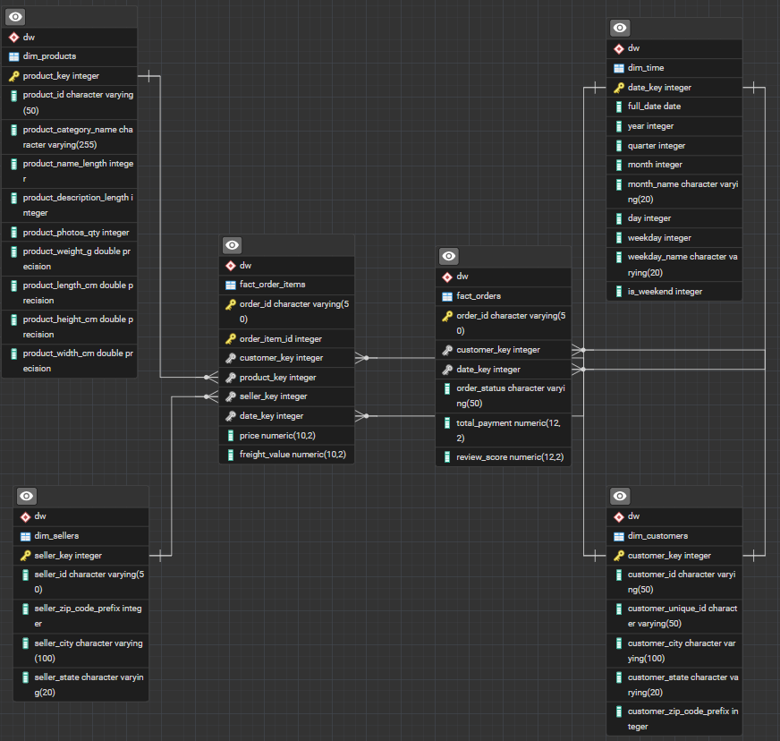
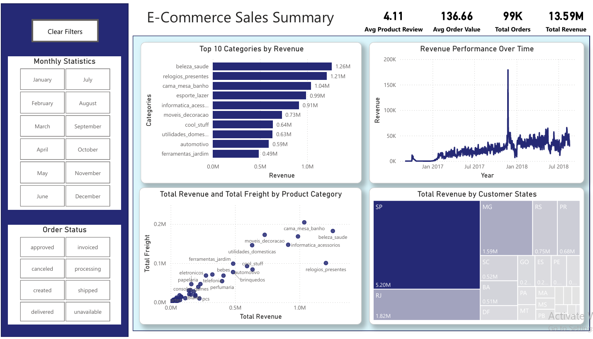

# E-Commerce Data Warehouse & Analytics Project

## Project Overview

This project implements an end-to-end analytics pipeline for an e-commerce dataset.  
The goal was to design a data warehouse, implement an ETL pipeline, perform analytical SQL queries, and build an interactive dashboard to extract business insights.

Project workflow:

Raw Data → ETL Pipeline → PostgreSQL Data Warehouse → SQL Analytics → Power BI Dashboard

Key goals:

- Design a star schema **data warehouse**
- Build a **Python ETL pipeline**
- Perform **analytical SQL queries**
- Extract **business insights**
- Build an **interactive Power BI dashboard**

---

## Tech Stack

- **Python** – ETL pipeline
- **PostgreSQL** – Data warehouse
- **SQL** – Analytical queries
- **Microsoft Power BI** – Interactive dashboard

---

## Data Warehouse Design

The warehouse follows a **denormalized star schema** to improve optimization and reduce join need in queries.

## Warehouse Schema

The warehouse consists of **6 tables**.

### Fact Tables

`fact_orders`

Contains order-level metrics:

- order status
- review score
- timestamps

`fact_order_items`

Contains item-level sales data:

- product
- seller
- price
- freight value

These tables represent **measurable business events**.

---

### Dimension Tables

`dim_customers`

Customer information used for segmentation and analysis.

`dim_products`

Product attributes used to analyze product performance.

`dim_sellers`

Seller data used for marketplace performance analysis.

`dim_time`

Time dimension used for efficient temporal aggregations.

---

## Schema Diagram



The diagram represents the **dimensional model implemented in PostgreSQL**.

**Note:**  
The Power BI relationship view may differ slightly to prevent ambiguity. The warehouse schema reflects the true data model used for analytics.

---

## ETL Pipeline

The ETL process transforms the raw dataset into a structured warehouse.

Steps:

1. Extract

    - Raw CSV datasets were loaded.

2. Transform

    - Cleaned inconsistent values

    - Generated surrogate keys

    - Converted timestamps

    - Structured data according to dimensional modeling principles.

3. Load

    - Data inserted into PostgreSQL warehouse tables.


---

## Analytical SQL Queries

Several SQL queries were developed to answer business questions such as:

- revenue growth over time
- highest value orders
- most profitable sellers
- customer purchasing patterns
- review score distribution

Queries can be found in: [SQL](/sql/)

---

## Key Insights

Examples of insights extracted from the analysis:

- Revenue shows steady growth across years, indicating increasing platform activity.
- A small number of sellers generate a large portion of total revenue.
- Most customer review scores are high, suggesting strong customer satisfaction.
- Some product categories generate high revenue despite lower order volume.

Detailed insights are documented in: [Insights](/analytics/insights.md)

---

## Dashboard

An interactive Power BI dashboard was created to visualize key metrics and trends.

The dashboard enables exploration of:

- revenue trends over time
- product category performance
- review score distribution
- order status breakdown

### Dashboard Preview



---

## Interactive Dashboard

The full interactive dashboard can be viewed here:
[PowerBI dashboard](https://app.powerbi.com/view?r=eyJrIjoiYjllNzY4NmQtZmUxZC00ZWRmLTk5ZTUtMmNhNjg3N2E3NDE1IiwidCI6IjJhNTQzZDQ1LWE5NzItNDQ3NC05ZDUzLWRjZjFhOTdlMTYyMyIsImMiOjl9&pageName=ce4641fe55a80b0089e6)


## Project Structure

```
ecommerce-data-warehouse/
│
├── data/
│   ├── raw/
│   └── processed/
│
├── etl/
│  
├── sql/
│
├── analytics/
│   └── result_screenshots/
│   └── insights.md
│
├── dashboard/
│   ├── dashboard.pbix
│   └── dashboard_overview.png
│
├── schema/
│   └── warehouse_schema.png
│
└── README.md
└── .gitignore
└── requirements.txt
```

---

## Skills Demonstrated

This project demonstrates practical experience with:

- dimensional data modeling
- data warehouse design
- ETL pipeline development
- SQL analytics
- business insight generation
- dashboard development
- data visualization
